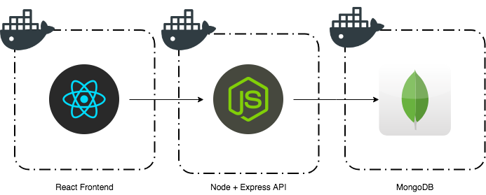

# Docker Boilerplate

This is a boilerplate project for a docker based node application. Each service should be very loosely coupled, with the frontend consuming a REST API supplied by the node backend, connected to a mongodb backend.



Services are contained in individual folders:

docker-mongo  : The mongodb database    (default port:27017)  
docker-node   : The node backend API    (default port:3000)  
docker-react  : The react frontend app  (default port:5000)  

## How to...
### Run in development mode
Runs services locally, with hot-reload etc enabled
> npm run-script start-dev

### Stop dev mode servers running
Stops local services running  
Exit react console:  ```ctrl-c```  
Stop other services: ```npm run-script stop-dev```  

### Run in production mode
Runs locally, dockerized, no hot reloading
> npm run-script start-prod

### Stop prod mode servers running  
Stop everything: ```npm run-script stop-prod```

### Run unit tests
**This does not set up the environment. You must start dev-mode first.**  
Runs docker-node unit tests.
> npm test

## Available npm scripts
### Test
> npm test

Runs unit tests. Currently only docker-node unit tests are set up.

Runs the start-test command to boot up docker-node and docker-mongo in dev mode. Does not run docker-react because it doesn't run in the background by default and will therefore block the execution of tests.

### Build
> npm build

Builds docker container images.

### Publish
> npm run-script publish

Publishes docker container images to the docker cloud.

### Start
> npm start

Starts up the local production environment using docker compose. This doesn't build or publish the containers first, so use Start-prod for normal production testing.

### Start-prod
> npm run-script start-prod

Builds, Publisheds and Starts up the local production environment. Use this for normal production testing.

### Stop-prod
> npm run-script stop-prod

Stops the local production environment and all containers started by docker compose.

### Start-dev
> npm run-script start-dev

Clears databases and starts up the local dev environment. React is started with create-react-app. node is started with pm2. Mongo is started in a docker container.

### Stop-dev
> npm run-script stop-dev

Stops the local dev environment and all containers started by pm2 and docker.
